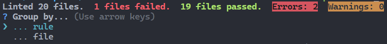
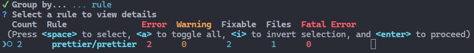

# eslint-formatter-interactive

[](https://github.com/matzehecht/eslint-formatter-interactive/blob/main/LICENSE)
[](https://www.npmjs.com/package/eslint-formatter-interactive)
[](https://www.npmjs.com/package/eslint-formatter-interactive)
[](https://www.npmjs.com/package/eslint-formatter-interactive)
[](https://github.com/matzehecht/eslint-formatter-interactive/stargazers)

Ever had > 1k eslint issues? 🤯  
The interactive eslint-formatter comes to the rescue. 🛟⛑️

> ***Note**:* The idea of this formatter is inspired by the great tool [eslint-nibble](https://github.com/IanVS/eslint-nibble) by [IanVS](https://github.com/IanVS).

eslint-formatter-interactive summarizes the eslint result for you, while also offering an interactive way to inspect the details.
An integration with the eslint autofix feature is planned.

## Features

- **Interactive Interface**: Navigate through eslint issues interactively.
- **Efficient Fixes**: Quickly identify and fix eslint errors and warnings.
- **Developer-Friendly**: Designed to be easy to use, even with a large number of issues.

## Installation

eslint-formatter-interactive is not intended to be the primary formatter of your tool. E.g. it requires an interactive shell and is therefore not wuited to run in an CI or similar. It is therefore also not meant to be kept in your project and is recommended to be installed with the `--no-save` flag.

To install the eslint-formatter-interactive, run:

```sh
npm install --no-save eslint-formatter-interactive
```

## Usage

To use the formatter just run:

```sh
npx eslint . --format interactive
```

eslint-formatter-interactive will print a small summary and will give you the choice to group the results by rule or by file:  


After choosing the grouping variable a rundown off all findings grouped by the chosen grouping variable will be shown. You can now select all the groups you want to see the details of.  


(In future eslint-formatter-interactive will integrate the eslint auto fix feature in this place)  
Last but not least: the details will be printed using the eslint stylish formatter.

## License

This project is licensed under the MIT License. See the [LICENSE](LICENSE) file for details.
